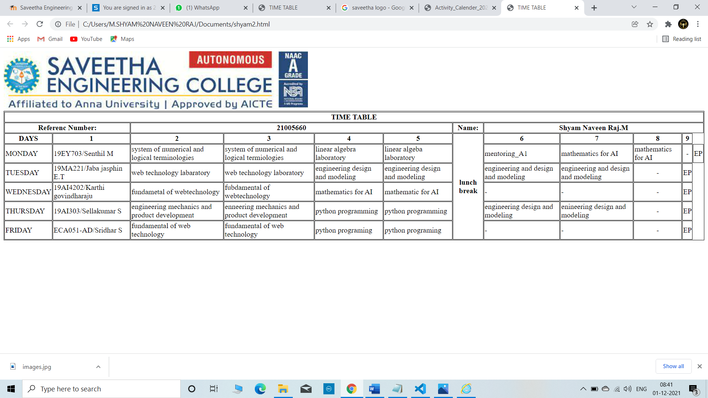

# Experiment_Time_Table

## AIM
To Write a html webpage page to display your timetable.

# ALGORITHM
### STEP 1
create a simple table using table tag
### STEP 2
Add header row using th tag
### STEP 3
Add your timetable
### STEP 4
Execute the program

# CODE
~~~<!DOCTYPE html>
<html>

   <head>
      <title>TIME TABLE</title>
   </head>
	
   <body>
      
      <table border = "1" cellspacing="1" bordercolor="black" bgcolor="white">
         <tr>
            <th colspan="12">TIME TABLE</th>
           

         </tr>
         <tr>
            <th colspan="2">Referenc Number:</th>
            <th colspan="4">21005660</th>
            <th colspan=:"7">Name:</th>
            <th colspan="8">Shyam Naveen Raj.M </th>
         
         <tr>
            <th>DAYS</th>
            <th>1</th>
            <th>2</th>
            <th>3</th>
            <th>4</th>
            <th>5</th>
            <th rowspan="6">lunch break</th>
            <th>6</th>
            <th>7</th>
            <th>8</th>
            <th>9</th>
         </tr>
         
        
         <tr>
             <td>MONDAY</td>
             <td>19EY703/Senthil M</td>
             <td>system of numerical and logical terminologies</td>
             <td>system of numerical and logical termiologies </td>
             <td>linear algebra laboratory </td>
             <td>linear algeba laboratory </td>
             <td>mentoring_A1</td>
             <td>mathematics for AI</td>
             <td>mathematics for AI</td>
             <td align="center">-</td>
             <td align="center">EP</td>
         </tr>
       <tr>
             <td>TUESDAY</td>
             <td>19MA221/Jaba jasphin E.T</td>
             <td>web technology labaratory</td>
             <td>web technology laboratory</td>
             <td>engineering design and modeling</td>
             <td>engineering design and modeling</td>
             <td>engineering and design and modeling</td>
             <td>engineering and design and modeling</td>
             <td align="center">-</td>
             <td align="center">EP</td>
         </tr>
           
         <tr>
             <td>WEDNESDAY</td>
             <td>19AI4202/Karthi govindharaju</td>
             <td>fundametal of webtechnology </td>
             <td>fubdamental of webtechnology</td>
             <td>mathematics for AI</td>
             <td>mathematic for AI</td>
             <td> - </td>
             <td> - </td>  
             <td align="center">-</td>
             <td align="center">EP</td>
         </tr>
         
          <tr>
             <td>THURSDAY</td>
             <td>19AI303/Sellakumar S</td>
             <td>engineering mechanics and product development</td>
             <td>enneering mechanics and product development</td>
             <td>python programming</td>
             <td>python programming</td>
             <td>engineering design and modeling</td>
             <td>enineering design and modeling</td>
             <td align="center">-</td>
             <td align="center">EP</td>
         </tr>

          <tr>
             <td>FRIDAY</td>
             <td>ECA051-AD/Sridhar S</td>
             <td>fundamental of web technology</td>
             <td>fundamental of web technology</td>
             <td>python programing</td>
             <td>python programing</td>
             <td> - </td>
             <td> - </td>
             <td align="center">-</td>
             <td align="center">EP</td>
         </tr>
  
         
      </table>
      
   </body>
</html>

  
         
      </table>
      
   </body>
</html>

      

  
         
      </table>
      
   </body>
</html>

~~~
##  OUPUT
